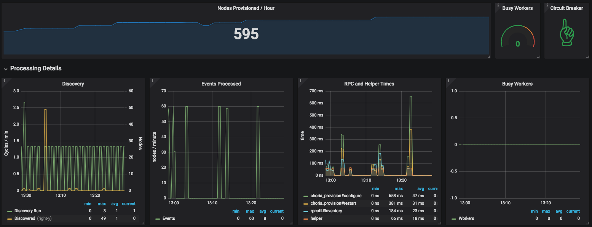

# Auto Provisioning System For Choria Server

Choria Server supports a Provisioning mode that assists bootstrapping the system in large environments or dynamic cloud based environments that might not be under strict CM control.

When an unconfigured Choria Server is in provisioning mode it will connect to a compiled-in Middleware network and join the `provisioning` sub collective.  It will optionally publish it's metadata and expose it's facts.

You can think of this as a similar setup as the old Provisioning VLANs where new servers would join to PXE boot etc. but here we expose an API that let the provisioning environment control the node.

The idea is that an automated system will discover nodes in the `provisioning` subcollective and guide them through the on-boarding process.  The on-boarding process can be entirely custom, one possible flow might be:

  * Discover all nodes in the `provisioning` subcollective with the `choria_provision` agent
    * For every discovered nodes
        * Retrieve facts and metadata
        * Based on it's facts programmatically determine which Member Collective in a [Federation](https://choria.io/docs/federation/) this node should belong to.
        * Ask the node for a CSR, potentially supplying a custom CN, OU, O, C and L
        * Sign the CSR the node provided against your own CA
        * Construct a configuration tailored to this node, setting things like SRV domain or hard coded brokers
        * Send the configuration, certificate and CA chain to the node where it will configure itself
        * Request the node restarts itself within a provided splay time

After this flow the node will join it's configured Member Collective with it's signed Certificate and CA known it becomes a normal node like any other.

You can invoke the `choria_provision#reprovision` action to ask it to leave its Member Collective and re-enter the provisioning flow.

If you have a token compiled in you can restart a server when not in provisioning mode with the token via the `choria_provision#restart` action.

This project includes a provisioner that you can use, it will call a `helper` that you provide and can write in any language to integrate with your CA and generate configuration.

## Configuring Choria Server

Provisioning is enabled in the Open Source server by means of a JWT token that you create during provisioning. The JWT token holds all of the information the server
needs to find it's provisioning server and will present that token also to the provisioning server for authentication.

The token is signed using a trusted private key, the provisioner will only provision nodes presenting a trusted key.

```nohighlight
$ choria tool jwt provisioning.jwt key.pem --srv choria.example.net --token toomanysecrets
```

Here we create a `provisioning.jwt` that will instruct Choria to look for `_choria-provisioner._tcp.choria.example.net` SRV
records to find the server to connect to.

Other options can be set for example to hard code provisioning URLs, username and passwords and more.

When this file is placed in `/etc/choria/provisioning.jwt` and Choria starts without a configuration it will provision
via these settings.

Choria also support provisioning plugins to resolve this information dynamically but this requires custom binaries and should
in general be avoided.

## Provisioning nodes

The agent has the following actions:

  * **gencsr** - generates a private key and CSR on the node, returns the CSR and directory they were stored in
  * **configure** - configures a node with the given configuration, signed certificate and ca and path to the ssl store
  * **restart** - restarts the server after a random splay
  * **reprovision** - re-enter provisioning mode
  * **release_update** - update the choria binary in-place from a repository

Each action takes an optional token which should match that compiled into the Choria binary via the `ProvisionToken` flag.

You can either write your own provisioner end to end or use one we provide and plug into it with just the logic to hook into your CA and logic for generating configuration.

### Use our provisioner

A provisioner project is included that can be used to provision your nodes, it allows you to hook in a program to compute the config and integrate with your SSL.  It has this generic flow:

Nodes will be discovered at startup and then every `interval` period:

  * Discover all nodes
    * Add each node to the work list

It will also listen on the network for registration and lifecycle events:

  * Listen for node registration and lifecycle events
    * Add each node to the work list

Regardless of how a node was found, this is the flow it will do:

  * Pass every node to a worker
    * Fetch the inventory using `rpcutil#inventory`
    * Request a CSR if the PKI feature is enabled using `choria_provision#gencsr`
    * Call the `helper` with the inventory and CSR, expecting to be configured
      * If the helper sets `defer` to true the node provisioning is ended and next cycle will handle it
    * Configure the node using `choria_provision#configure`
    * Restart the node using `choria_provision#restart`

When this provisioner start up it will emit a `choria:lifecycle:startup:1` event with component `provisioner`.

#### Writing the helper

Your helper can be written in any language, it will receive JSON on its STDIN and should return JSON on its STDOUT. It should complete within 10 seconds and could be called concurrently.

The input is in the format:

```json
{
	"identity": "dev1.devco.net",
	"csr": {
		"csr": "-----BEGIN CERTIFICATE REQUEST-----....-----END CERTIFICATE REQUEST-----",
		"ssldir": "/path/to/ssldir"
	},
	"inventory": "{\"agents\":[\"choria_provision\",\"choria_util\",\"discovery\",\"rpcutil\"],\"facts\":{},\"classes\":[],\"version\":\"0.0.0\",\"data_plugins\":[],\"main_collective\":\"provisioning\",\"collectives\":[\"provisioning\"]}"
}
```

The CSR structure will be empty when the PKI feature is not enabled, the `inventory` is the output from `rpcutil#inventory`, you'll be mainly interested in the `facts` hash I suspect. The data is JSON encoded.

The output from your script should be like this:

```json
{
  "defer": false,
  "msg": "Reason why the provisioning is being defered",
  "certificate": "-----BEGIN CERTIFICATE-----......-----END CERTIFICATE-----",
  "ca": "-----BEGIN CERTIFICATE-----......-----END CERTIFICATE-----",
  "configuration": {
    "plugin.choria.server.provision": "false",
    "identity": "node1.example.net"
  }
}
```

If you set the `ProvisionModeDefault` compile time flag to `"true"` then you must set `plugin.choria.server.provision` to `"false"` else provisioning will fail to avoid a endless loop.

If you want to defer the provisioning - like perhaps you are still waiting for facts to be generated - set `defer` to true and supply a reason in `msg` which will be logged. The node will be tried again on the following cycle.

If you do not care for PKI then do not set `certificate` and `ca`.

The `configuration` contains the config in key value pairs where everything should be strings, this gets written directly into the Choria Server configuration.

#### Sample CFSSL Helper

Here's a sample helper that support enrolling nodes into a CFSSL CA, the CA is assumed to be running and listening on `localhost:8888`.  We use this helper in production and can provision 1000 nodes in under a minute using it - including enrolling in the CA.

For this to work place the CA bundle in `/etc/choria-provisioner/ca.pem`.

```ruby
#!/opt/puppetlabs/puppet/bin/ruby

require "json"
require "open3"

input = STDIN.read

request = JSON.parse(input)
request["inventory"] = JSON.parse(request["inventory"])

reply = {
  "defer" => false,
  "msg" => "",
  "certificate" => "",
  "ca" => "",
  "configuration" => {}
}

identity = request["identity"]
brokers = "broker.example.net:4222"
registerinterval = "300"
registration_data = "/etc/node/metadata.json"

# PKI is optional, if you do enable it in the provisioner this code will kick in
if request["csr"] && request["csr"]["csr"]
  begin
    out, err, status = Open3.capture3("/path/to/cfssl sign -remote http://localhost:8888 -", :stdin_data => request["csr"]["csr"])
    if status.exitstatus > 0 || err != ""
      raise("Could not sign certificate: %s" % err)
    end

    signed = JSON.parse(out)

    if signed["cert"]
      reply["ca"] = File.read("/etc/choria-provisioner/ca.pem")
      reply["certificate"] = signed["cert"]
    else
      raise("Did not received a signed certificate from cfssl")
    end

    ssldir = request["csr"]["ssldir"]

    reply["configuration"].merge!(
      "plugin.security.provider" => "file",
      "plugin.security.file.certificate" => File.join(ssldir, "certificate.pem"),
      "plugin.security.file.key" => File.join(ssldir, "private.pem"),
      "plugin.security.file.ca" => File.join(ssldir, "ca.pem"),
      "plugin.security.file.cache" => File.join(ssldir, "cache")
    )
  rescue
    reply["defer"] = true
    reply["msg"] = "cfssl integration failed: %s: %s" % [$!.class, $!.to_s]
  end
end

reply["configuration"].merge!(
  "identity" => identity,
  "registerinterval" => registerinterval,
  "plugin.choria.middleware_hosts" => brokers,
  "plugin.choria.registration.file_content.data" => registration_data,
  # include any other settings you wish to set
)

puts reply.to_json
```

#### Configuring the provisioner

The provisioner takes a YAML or JSON configuration file, something like:

```yaml
---
# how many concurrent provisions can be run
workers: 4

# how frequently to start the cycle in go duration format
interval: 5m

# where to log
logfile: "/var/log/provisioner.log"

# loglevel - debug, info, warn, error
loglevel: info

# path to your helper script
helper: /usr/local/bin/provision

# the token you compiled into choria
token: toomanysecrets

# if your provision network has no TLS set this
choria_insecure: true

# a site name exposed to the backplane to assist with discovery, also used in stats
site: testing

# sets a custom lifecycle component to listen on for events that trigger provisioning
lifecycle_component: acme_provisioning

# Certificate patterns that should never be signed from CSRs, these are ones choria
# set aside as client only certificates and someone might configure a node to obtain
# a signed cert otherwise.  When not set below is the default value
cert_deny_list:
  - "\.choria$"
  - "\.mcollective$"
  - "\.privileged.choria$"
  - "\.privileged.mcollective$"

# if not 0 then /metrics will be prometheus metrics
monitor_port: 9999

features:
  # enables fetching of the CSR
  pki: true

# Standard Backplane specific configuration here, see
# https://github.com/choria-io/go-backplane for full reference
# if this is unset the backplane is not enabled
management:
    name: provisioner
    logfile: /var/log/provisioner-backplane.log
    loglevel: info
    tls:
        scheme: puppet

    auth:
        full:
            - sre.mcollective

        read_only:
            - 1stline.mcollective

    brokers:
        - choria1.example.net:4222
        - choria2.example.net:4222
```

A choria client configuration should be made in `/etc/choria-provisioner/choria.cfg`, it looks like a normal choria client config and would support SRV and all the usual settings.

#### Backplane

The provisioner includes a [Choria Backplane](https://github.com/choria-io/go-backplane) with Pausable and FactSource features enabled. Using this you can emergency pause the provisioner and all calls to RPC, Helpers and Discovery will be stopped.  No new nodes will be added via the event source.

Full details of configuration, RBAC and the backplane management utility can be found on the above project page.

#### Statistics

The daemon keeps a number of Prometheus format stats and will expose it in `/metrics` if the `monitor_port` settings is over 0.

|Statistic|Descriptions|
|---------|------------|
|choria_provisioner_rpc_time|How long each RPC request takes|
|choria_provisioner_helper_time|How long the helper takes to run|
|choria_provisioner_discovered|How many nodes are discovered using the broadcast discovery|
|choria_provisioner_event_discovered|How many nodes were discovered due to events being fired about them|
|choria_provisioner_discover_cycles|How many discovery cycles were ran|
|choria_provisioner_rpc_errors|How many times a RPC request failed|
|choria_provisioner_helper_errors|How many times the helper failed to run|
|choria_provisioner_discovery_errors|How many times the discovery failed to run|
|choria_provisioner_provision_errors|How many times provisioning failed|
|choria_provisioner_paused|1 when the backplane paused operations, 0 otherwise|
|choria_provisioner_busy_workers|How many workers are busy processing servers|
|choria_provisioner_provisioned|Host many nodes were successfully provisioned|

A Grafana dashboard is included in `dashboard.json` that produce a set of graphs like here:



#### Packages

RPMs are hosted in the Choria yum repository for el6 and 7 64bit systems, packages are called `choria-provisioner`:

```ini
[choria_release]
name=choria_release
baseurl=https://packagecloud.io/choria/release/el/$releasever/$basearch
repo_gpgcheck=1
gpgcheck=0
enabled=1
gpgkey=https://packagecloud.io/choria/release/gpgkey
sslverify=1
sslcacert=/etc/pki/tls/certs/ca-bundle.crt
metadata_expire=300
```

## Thanks


